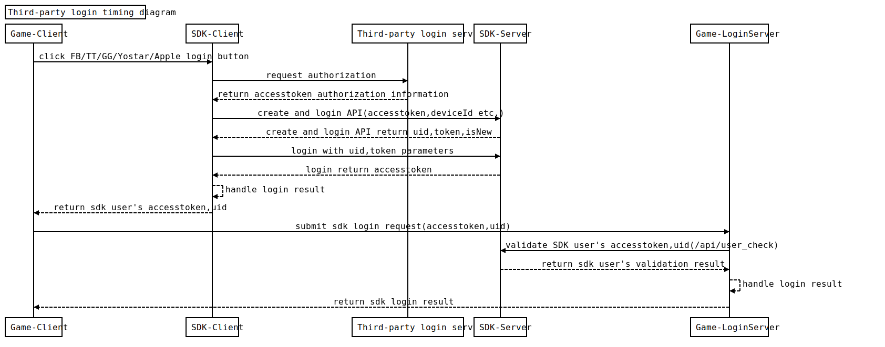
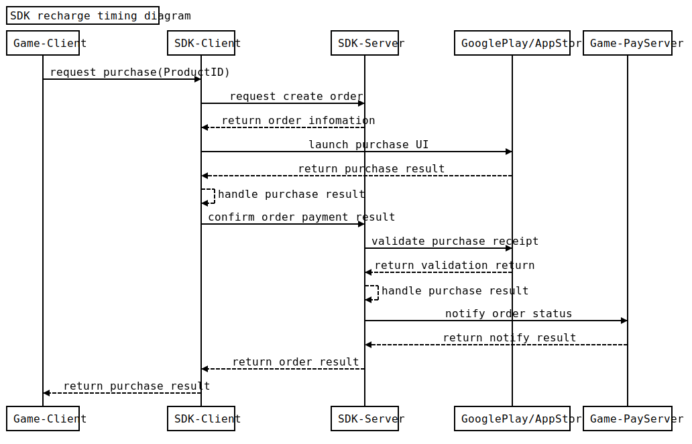

| Date | Version | Description | Written/Edited by | Approved By |
| --- | --- | --- | --- | --- |
| 2017-7-17 | V1.0.0 | First Edition |   |   |
| 2018-11-5 | V1.0.1 | Edit |   |   |
| 2019-1-21 | V1.0.2 | Edit |   |   |
| 2019-11-5 | V1.0.3 | Edit |   |   |
| 2019-11-25 | V1.0.4 | Edit |   |   |
| 2020-1-2 | V1.0.5 | Edit |   |   |
| 2020-2-6 | V1.0.6 | Add Header |   |   |
| 2021-1-11 | V1.0.7 | AddRefundNotify |   |   |

# 1.Prologue

This document shall be used as a guidelines for Yostar server API specification, which offers the developers a better understanding of the API protocols between the "SDK server" and the "Game server".

## 1.1.Communication Protocols

### 1.1.1.Introduction

This API uses HTTP(S) as its communication protocol. The caller can initiate an API request to the "SDK server" by sending a HTTP(S) request (POST/GET method).

This service allows the game server to call data API from the SDK server. We provide you API domains as shown below:

http://???.api.yostar.com

We provide: API domain, notifySecretKey(Verify Server Notify)，userAppKey(Verify User Accesstoken)

We need: notifyUrl, which serves as a notification address

### 1.1.2.SDK Server Data Acquisition Example

POST [http://](http://azurapi.yostar.co.jp/)[???.api](http://azurapi.yostar.co.jp/)[.yostar.](http://azurapi.yostar.co.jp/)[com](http://azurapi.yostar.co.jp/)/user/login

uid=12523819&token=27c265995d5e44919ee711cb96b45321&deviceId=6d9e2d00fd11

### 1.1.3.Data Response Examples

Normal Return Data

200 OK

Content-Type: application/json

{

    "result": 0,

    "accessToken": "ce0b276f3f0c43c6899cc05b2dc835c5",

    "birth": "20040817"

}

Abnormal Return Data

200 OK

Content-Type: application/json

{

    "result": 1

}

## 1.2.Data Protocols

### 1.2.1.Character Encoding

Requests and responses must use UTF-8 character encoding.

# 2.API List

## 2.1.User Verification API

- API description: User verification
- HTTP request method: GET
- Request address: http[://](http://192.168.51.207:9011/dataSync/getSyncsData)[???.api](http://192.168.51.207:9011/dataSync/getSyncsData)[.yostar.c](http://192.168.51.207:9011/dataSync/getSyncsData)[om](http://192.168.51.207:9011/dataSync/getSyncsData)[/](http://192.168.51.207:9011/dataSync/getSyncsData)api/user\_check

- Request for Data

| Parameter | Necessity | Type | Description |
| --- | --- | --- | --- |
| uid | Y | String | User ID |
| token | Y | String | The value of  this "token"is "accessToken",  a parameter used when users log in |
| sign | Y | String | MD5parameter signature, the string should be："userID=" + uid + "token=" + token + userAppKey |
| returnBirth | N | String | After the verification is successful, whether to return birth birthday (1: yes, other: no) |

- Data in Response

| Parameter | Necessity | Type | Description |
| --- | --- | --- | --- |
| state | Y | Int | 1: success; 99: verification failed |
| msg | Y | String | 'SUCCESS': success; 'INVALID': fail |
| birth | N | String | Birthday, format YYYYMMDD, if not set, returns the string "" |

- Request for Data as Developers

- Example

uid=12523823&token=fd4a9c3aff4d4752ba91d3744d4a2abd&sign=94017a896bad4ac2b0879d2b1624e991&returnBirth=1

- Result

- JSON Example

{

    "state": 1,

    "msg": "SUCCESS",

    "birth": "19630405"

}

## 2.2.Payment Result Callback API

- API description: Payment result notification address, provided by developers. When the SDK is being implemented, the developers need to provide Yostar with this notification address, so it can be added into the system.
- HTTP request method: POST
- Request address: appstoreNotifyUrl,googleplayNotifyUrl, notification addressprovided by developers (please ask Yostar to add it into the system)

- Request Header

| Parameter | Necessity | Type | Description |
| --- | --- | --- | --- |
| airiadmin | N | string | Whether the requested data is manually filled (0 or does not exist: Normal; 1: Manually filled in the Admin Management Background System) |

- Request Parameters for Data

| Parameter | Necessity | Type | Description |
| --- | --- | --- | --- |
| data | Y | json | Request fordata information, json file, more detailed information can be found in Data information below |
| state | Y | int | 1: success; 0: fail; 2: refund |

- Data Information

| Parameter | Necessity | Type | Description |
| --- | --- | --- | --- |
| orderId | Y | string | Yostar Order ID |
| productId | Y | string | Item ID configured in the Google/Apple store |
| uid | Y | Int/string | User ID, Convert to string when exceeding JSON to indicate int precision |
| money | Y | int/float | Value Equals Payment amount \* 100 |
| extension | Y | string | Others |
| signType | Y | string | String"md5" |
| sign | Y | string | I(1: success; 0: fail):MD5 Encrypted Signature, signature is spliced alphabetically(exclude signType)with data parameter keys. Field: Sort field names alphabetically with an ascending order during the naming process. Then add "&" and "notifySecretKey" provided by Yostar into the string.Example:extension=ext&money=120&orderId=5002813077261056069&productId=product\_sub\_passport01&uid=12523825&e142d7604715610ae1d71a1ca74b8b9c II(state=othervalue): MD5 Encrypted Signature, signature is spliced alphabetically(exclude signType)with data parameter keys. Field: Sort field names alphabetically with an ascending order during the naming process. Then add "&state=[statevalue]&" and "notifySecretKey" provided by Yostar into the string.Example:extension=ext&money=120&orderId=5002813077261056069&productId=product\_sub\_passport01&uid=12523825&state=2&e142d7604715610ae1d71a1ca74b8b9c |

- Data in Response

| Response | Description |
| --- | --- |
| SUCCESS or others | SUCCESS: the order is completed, Yostar will not notify the developers if they receive this response;fail or others: fail (Other error messages can also be returned, Yostar will repeatedly notify the developers) |

- Notes

After a user payment order is completed, SDK server will try to notify the game server asynchronously until a result is obtained.The details of Asynchronous Notification API are listed below:

- Must ensure the server asynchronous notification page (notify\_url) has no characters, such as spaces, HTML tags, and abnormal messages from development system;
- When the SDK server sends notification message through POST method, only one parameter named "data" will be sent. Inside "data" is a json string, after json decoding there is an order array, thus the methods of acquiring data in the page are: Form("data") and $\_POST['data'];
- If the characters in Developer's response is not the exact 7 characters as "SUCCESS", SDK server will try to send a notification repeatedly, under normal circumstances, 12 notifications will be sent in 24 hours. Stop sending notification afterwards.
- After the program is executed, the page must not be forwarded/redirected to another page. If the page changes, it will be determined as functioning abnormally, and the SDK server will not receive "SUCCESS" and will try to a notification repeatedly.
- Cookies, sessions, etc. will become useless on this page, which means these kind of data cannot be received;
- This API can only be tested and operated online;
- Developers are responsible for verifying callback signatures and callback payment amounts. Only when both data match the requested nes can the purchased items be dispatched, this is to void user falsifying and tampering with the contents of the order.

- Requested by Yostar

- Example

POST

[http://](http://www.notifyUrl.com/)[???](http://www.notifyUrl.com/)[.notifyUrl.com](http://www.notifyUrl.com/)/

data={"extension":"ext\_id\_101","orderId":"91787165161483","productId":"product\_id\_01","uid":"147414535","money":300,"signType":"md5","sign":"9234t8y9rnqowry2ibri2r23r2r32"}&state=1

- Responded by Developers

- Example

SUCCESS

# 3.Server login recharge sequence diagram

