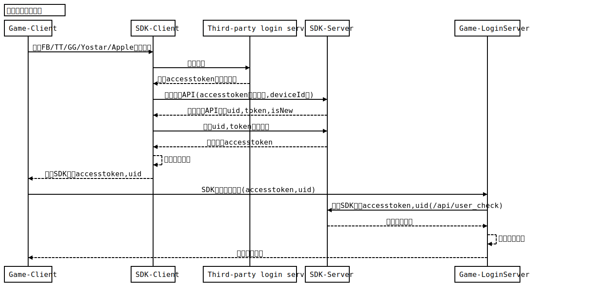
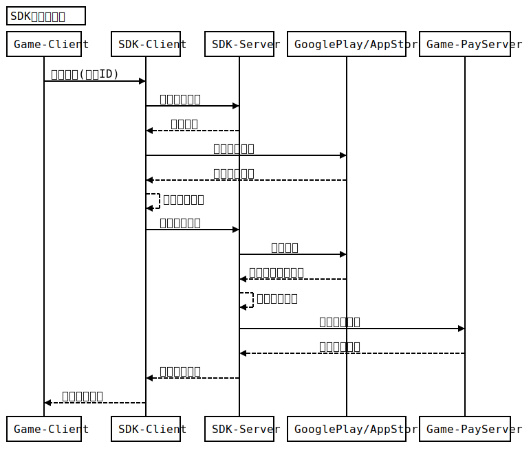

| 归档日期 | 版本 | 说明 | 作者 | 审批人 |
| --- | --- | --- | --- | --- |
| 2017-7-17 | V1.0.0 | 初稿 |   |   |
| 2018-11-5 | V1.0.1 | 修订 |   |   |
| 2019-1-21 | V1.0.2 | 修订 |   |   |
| 2019-11-5 | V1.0.3 | 修订 |   |   |
| 2019-11-25 | V1.0.4 | 修订 |   |   |
| 2020-1-2 | V1.0.5 | 修订 |   |   |
| 2020-2-6 | V1.0.6 | 修订增加Header |   |   |

目录

| |
| --- |
| 1. 概述 |
| 1.1. 通信协议 |
| 1.1.1. 概述 |
| 1.1.2. SDK服务端请求数据示例 |
| 1.1.3. 响应数据示例 |
| 1.2. 数据协议 |
| 1.2.1. 数据格式 |
| 1.2.1.1. SDK服务端请求 |
| 1.2.2. 字符编码 |
| |
| 2.1. 用户验证接口 |
| 2.2. 充值结果回调接口 |
| |

# 1.概述

本文档是Yostar服务端API的统一接口规范和开发指南。主要提供给Yostar游戏中心的"SDK服务器"和Yostar游戏合作商的"游戏服务端"的交互接口规范协议说明

## 1.1.通信协议

### 1.1.1.概述

本接口采用HTTPS 协议作为通信协议，调用方通过构造HTTPS 请求（POST/GET 方式）向""SDK服务器"发起接口请求。

本服务为游戏服务器调用SDK服务端请求数据接口，我们提供了接口域名如下：

https://???.api.yostar.com

Yostar提供：接口域名，notifySecretKey，userAppKey

CP需要提供 notifyUrl通知地址

### 1.1.2.SDK服务端请求数据示例

POST https://???.api.yostar.com/用户/检查

uid=12523819&token=27c265995d5e44919ee711cb96b45321&deviceId=6d9e2d00fd11

### 1.1.3.响应数据示例

以下为正常返回数据

200 OK

Content-Type: application/json

{

    "result": 0,

    "accessToken": "ce0b276f3f0c43c6899cc05b2dc835c5",

    "birth": "20040817"

}

以下为异常返回数据

200 OK

Content-Type: application/json

{

    "result": 1

}

## 1.2.数据协议

### 1.2.1.数据格式

#### 1.2.1.1.SDK服务端请求

-  **请求消息公共字段**

| 参数 | 必填 | 类型 | 描述 |
| --- | --- | --- | --- |
| accessToken | N | string | 请求的accessToken |

### 1.2.2.字符编码

请求与响应内容须采用UTF-8字符编码。

# 2.接口列表

## 2.1.用户验证接口

-  **接口描述：用户验证**
-  **HTTP S ****请求方式：**** GET**
-  **请求地址：** https://???.api.yostar.cm/api/user\_check

-  **请求参数**

| 参数 | 必填 | 类型 | 描述 |
| --- | --- | --- | --- |
| uid | Y | String | 用户uid |
| token | Y | String | 值为用户登录时的参数的accessToken |
| sign | Y | String | MD5参数签名,签名字符串为："userID=" + uid + "token=" + token + userAppKey |
| returnBirth | N | String | 验证成功后，是否返回birth生日（1：是，其他：否） |

-  **响应数据说明**

| 参数 | 必需 | 类型 | 描述 |
| --- | --- | --- | --- |
| state | Y | Int | 1：成功，99：验证失败 |
| msg | Y | String | 'SUCCESS'：成功，'INVALID'：失败 |
| birth | N | String | 生日，格式YYYYMMDD,若没设置过，返回字符串"" |

-  **CP 方请求参数**

-  **示例**

uid=12523823&token=fd4a9c3aff4d4752ba91d3744d4a2abd&sign=94017a896bad4ac2b0879d2b1624e991&returnBirth=1

-  **返回结果**

-  **JSON示例**

{

    "state": 1,

    "msg": "SUCCESS",

    "birth": "19630405"

}

## 2.2.充值结果回调接口

-  **接口描述：即充值结果通知地址，由游戏CP提供。游戏接入时，由游戏合作商提供给 Yostar ****游戏运营人员，录入到接入系统当中**
-  **HTTP S ****请求方式：**** POST**
-  **请求地址： appstoreNotifyUrl,googleplayNotifyUrl ****游戏CP提供的请求地址** (可以找Yostar方帮忙录入)

-  **请求 Header**

| 参数 | 必填 | 类型 | 描述 |
| --- | --- | --- | --- |
| airiadmin | **N** | string | 请求的数据是否手动补单（0或不存在:正常；1：后台手动补单） |

-  **请求参数**

| 参数 | 必填 | 类型 | 描述 |
| --- | --- | --- | --- |
| data | **Y** | json | 请求的数据data信息，json格式，详细请看下面的data信息 |
| state | **Y** | int | 1：成功，0：失败 |

-  **data信息**

| 参数 | 必需 | 类型 | 描述 |
| --- | --- | --- | --- |
| orderId | Y | string | Yostar方订单ID |
| productId | Y | string | 商店配置的商品ID |
| uid | Y | string | 用户ID |
| money | Y | int/float | 金额\*100 |
| extension | Y | string | 其他，不检查唯一 |
| signType | Y | string | 字符串"md5" |
| sign | Y | string | md5加密后的签名，签名方式为data的其他参数key（去除signType）按字母排序拼接，字段： **拼接时需对字段名排序** ，排序方式是按字段名进行字符串 **升序排列** 。最后再拼接上&和商务所提供约定的密钥notifySecretKey。示例：extension=ext&money=120&orderId=5002813077261056069&productId=product\_sub\_passport01&uid=12523825&e142d7604715610ae1d71a1ca74b8b9c |

-  **响应数据说明（该接口只有响应内容）**

| 响应内容 | 描述 |
| --- | --- |
| SUCCESS或者其他 | SUCCESS：表示处理订单成功，Yostar方收到响应SUCCESS后不会再通知给cp方fail或者其他：失败（也可返回其他错误信息，Yostar方收到后都会多次重复通知） |

-  **接口备注**

在用户支付订单完成后，Yostar方服务器会向商户方服务器发起通知，并异步不断尝试直到获取结果。以下为异步通知接口说明：

- 必须保证服务器异步通知页面(notify\_url)上无任何字符,如空格、HTML 标签、开发系统自带抛出的异常提示信息等;
- Yostar服务器使用POST 方式发送通知信息,只有一个参数名称为data,里面的数据是一个json字符串，json decode以后得到订单数组，因此该页面中获取参数的方式,如: request.Form("data")、$\_POST['data'];
- 程序执行完后必须打印输出"SUCCESS"(不包含引号， **不能加入换行符，缩进符等不可见字符** )。如果商户反馈给Yostar的字符不是这7 个字符,Yostar服务器会不断重发通知, 
一般情况下,28 小时以内完成12 次通知
- 程序执行完成后,该页面不能执行页面跳转。如果执行页面跳转,Yostar会收不到SUCCESS字符,会被Yostar服务器判定为该页面程序运行出现异常, 而重发处理结果通知;
- cookies、session 等在此页面会失效,即无法获取这些数据;
- 该方式的调试与运行必须在服务器上,即互联网上能访问;
- CP方不仅要对回调的签名进行验证，还需要对回调的金额进行比对，两方一致方可发货，避免用户造假篡改订单内容

-  **Yostar 方请求**

-  **示例**

POST

http://???.notifyUrl.com/

data={"extension":"ext\_id\_11101","orderId":"91787165161483","productId":"product\_id\_01","uid":"147414535","money":300,"signType":"md5","sign":"9234t8y9rnqowry2ibri2r23r2r32"}&state=1

-  **CP 方 ****返回结果**

-  **示例**

SUCCESS

# 3.服务器登录充值时序图

